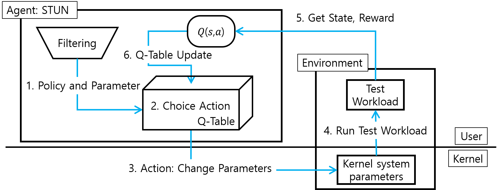
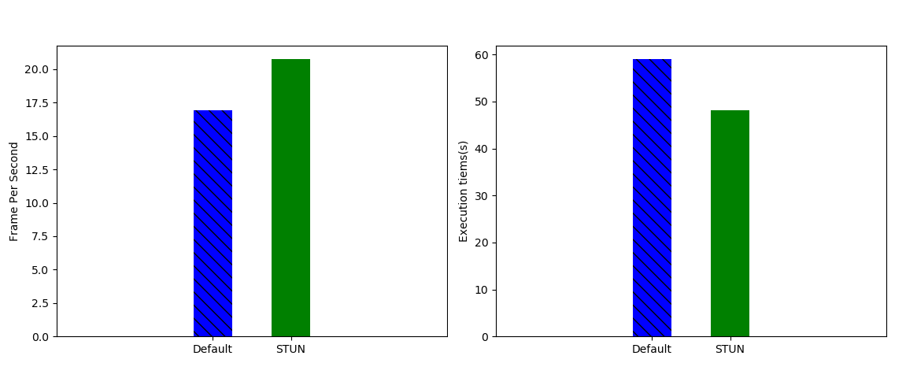
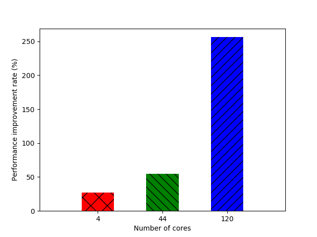

# STUN
Scheduler TUNer (STUN) is framework using reinforcement learning for optimizing scheduler. 
STUN tunning the five scheduling policies of the Linux kernel and about 10 parameters to automatically optimize for each workload environment.
Using STUN help optimize the performance of workload at the OS scheduler level without manual intervention of the scheduler.

STUN is licensed under the MIT license.


## Architecture
<div align="center">
  <figure>
      
  </figure>
</div>

## Features
- **Automatic Optimization**: Adjusts scheduling parameters without manual input.
- **Performance Improvement**: Enhances workload performance through dynamic tuning.
- **Flexible Configuration**: Supports multiple scheduling policies.


## Installation

* **Requirements**
  - OpenAI GYM
  - schedtool
  - Test benchmark
    - Sysbench or Hackbench...

* **RUN**
```bash
git clone https://github.com/myeong58/STUN.git
cd STUN
$ python3 main_state.py [num episode] [num step]
```


## Performance Testing

- **Performance comparison of face detection program using STUN**
<div align="center">
  <figure>
      
  </figure>
</div>

- **Performance improvement over default for each number of cores**
<div>
  <figure>
      
  </figure>
</div>

## Etc.
Demo video: [YouTube](https://www.youtube.com/watch?v=rbQf_j7UUeg&feature=youtu.be)

Paper: [STUN: Reinforcement-Learning-Based Optimization of Kernel Scheduler Parameters for Static Workload Performance. Appl. Sci. 2022](https://www.mdpi.com/2076-3417/12/14/7072)
